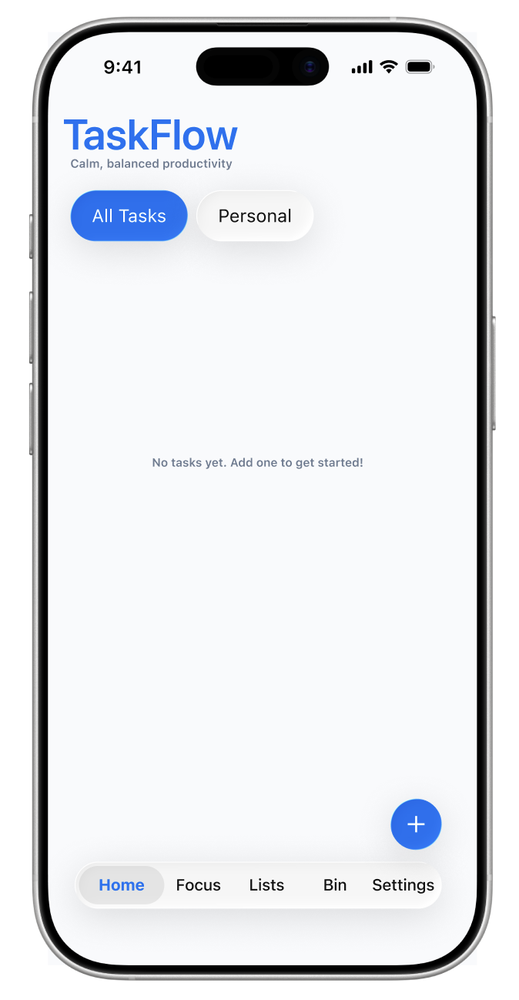
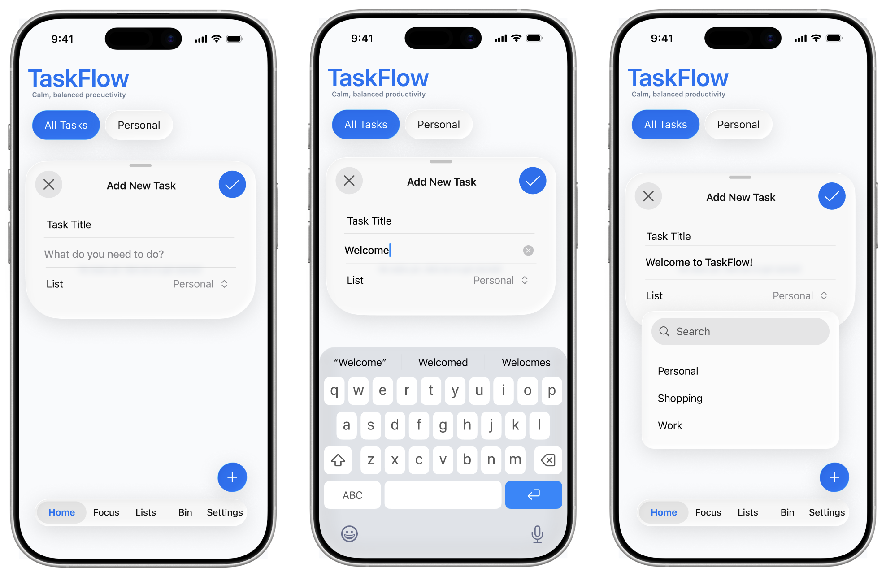
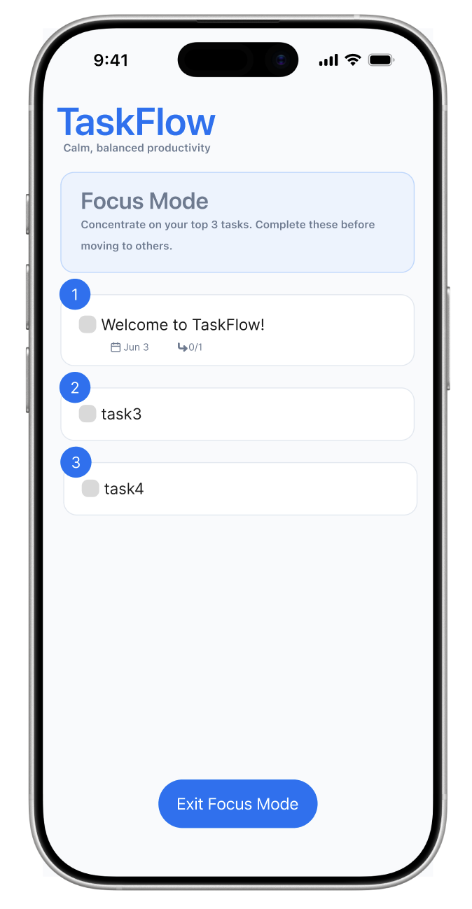
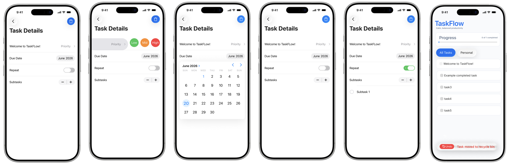
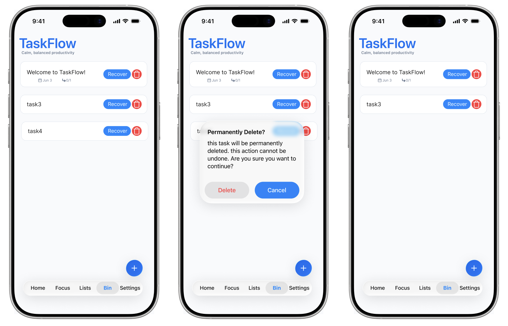

# TaskFlow – UI/UX Case Study

TaskFlow is a productivity-focused task management application designed to help users organize tasks, reduce overwhelm, and maintain focus through a clean and intuitive interface.

---

## Problem

Many task management applications overwhelm users with complex interfaces and too many features. This often leads to:

* Difficulty quickly capturing tasks
* Poor prioritization
* Loss of focus due to cluttered interfaces

---

## Solution

TaskFlow was designed as a user-centered solution to address these challenges by simplifying task management while promoting clarity and focus.

Key design goals:

* Reduce cognitive load through minimal UI
* Enable fast and intuitive task creation
* Support focused work with a dedicated focus mode
* Provide clear task prioritization and progress feedback

---

## Design Process

### 1. User Research

* Defined user personas representing different productivity styles
* Created usage scenarios to understand real-world workflows
* Identified key pain points such as overwhelm, distractions, and inefficient task entry

---

### 2. Interaction Design

Designed complete user flows for:

* Task creation
* Task organization and prioritization
* Focus mode for completing top tasks

Applied UX principles:

* **Progressive disclosure** to simplify the interface
* **Visual hierarchy** to guide user attention
* **Cognitive load reduction** through clean layouts

---

### 3. Prototyping

* Designed **16 high-fidelity screens** in Figma
* Built interactive components and transitions
* Maintained consistent design patterns across all screens

---

### 4. Evaluation & Iteration

* Conducted **heuristic evaluation (Nielsen’s principles)**
* Performed **cognitive walkthroughs**

Key improvements:

* Simplified focus mode to reduce distractions
* Improved task editing and recovery flows
* Added confirmation dialog for destructive actions to prevent errors

---

## Key Features

* Task creation with list categorization
* Priority selection (Low / Medium / High)
* Focus mode for completing top tasks
* Progress tracking with visual feedback
* Task recovery and deletion system
* Clean and minimal interface for improved usability

---

## Tools

* Figma (UI Design & Prototyping)

---

## Key User Flows & Screens

### Home & Task Overview

### Task Creation

### Focus Mode

### Task Details & Prioritization

### Error Prevention (Undo Deletion & Permanent Deletion)

---

## Figma Prototype

[View Interactive Prototype](https://www.figma.com/design/9qUoGayKba6D18mtXQ6E3n/TaskFlow-app?node-id=0-1&t=OgXEaqjZoP1Zv0E5-1)

---

## About

This project was developed as part of my HCI course, focusing on applying human-centered design principles to improve productivity and user experience in task management applications.
